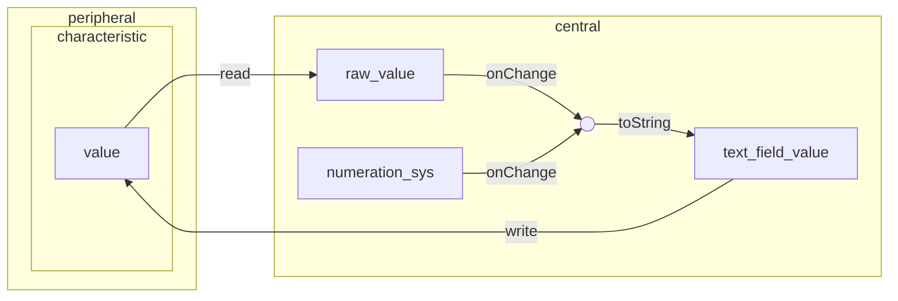

# ReactJS BLE Console

A console in web browser to debug and control BLE devices.
This repository depends on [Web Bluetooth API](https://developer.mozilla.org/docs/Web/API/Web_Bluetooth_API)

## Value R/W system

